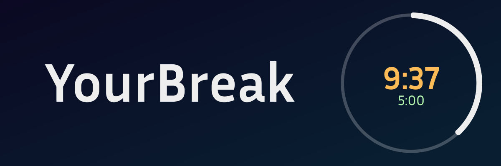
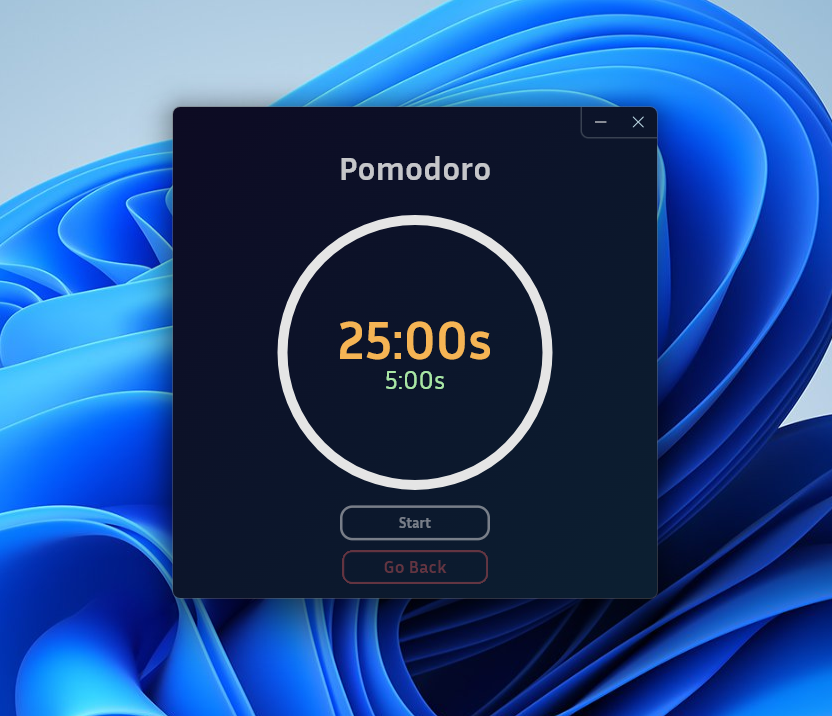
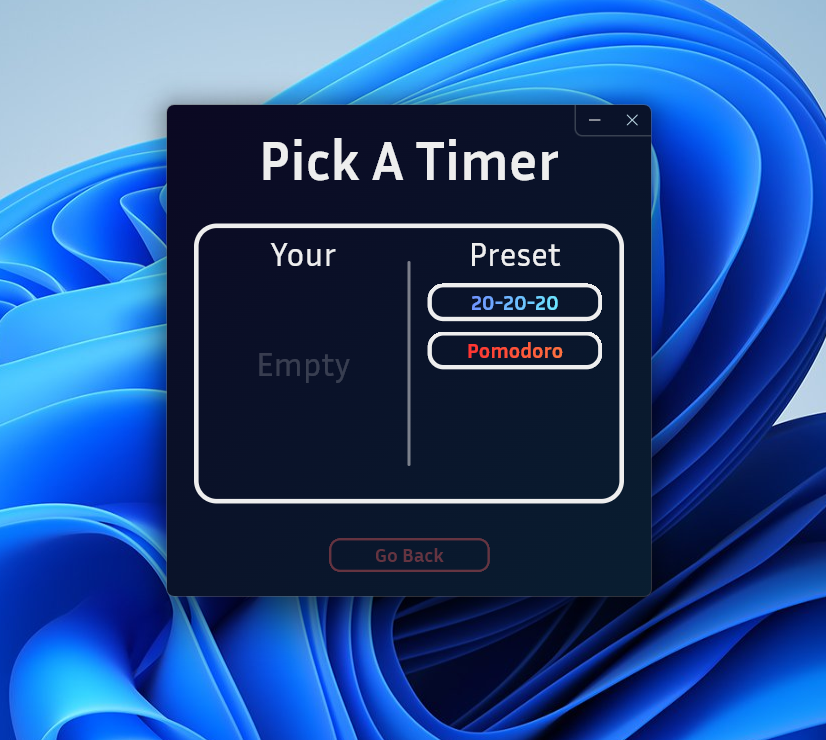
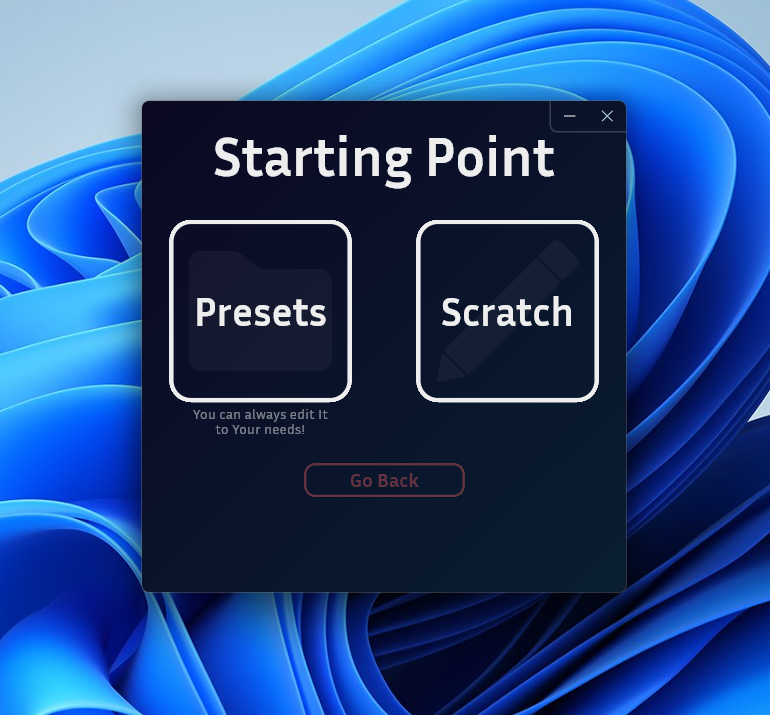

<div align="center">



---

# ⚠️ Project Status Notice ⚠️

### YourBreak is currently indefinitely paused by me as I am focusing on backend development. Others are welcome to contribute if they wish, but I will not be adding new features for now.

---

# YourBreak (v0.9)

> "Whatever you do, work at it with all your heart, as working for the Lord, not for human masters." - Colossians 3:23

**Dedicated to Christ.**

---


--- 

# Overview

</div>

## Why YourBreak?

Most timer apps lock you into rigid presets — **fixed work lengths, fixed break times, and a limited number of cycles.**  
That makes them simple, but not adaptable to how people actually work.

---

### ✨ What Makes YourBreak Different?
YourBreak allows you to create timers that fit ***you***.

- 🔲 **Add periods like blocks** to build your routine  
- 🕒 **Set the duration** for each block  
- 🎯 **Mix and match** work and breaks in any order you want  

> Example: `25m work → 5m break → 43m work → 2m rest`  
> YourBreak handles it all without restrictions.


---

### 🎯 Designed for Focus
The interface is built around one goal: **helping you stay focused.**  

- 🧘 **Clean & minimal** — only shows what you need in the moment  
- 🧭 **Effortless navigation** — two clear choices at a time, so decisions are easy and distraction-free

---







---
<div align="center">
 
# ⬇️ Download
### You can get the latest precompiled version from [Releases](https://github.com/Katanasoldier/YourBreak/releases)
### - 🖥️ Windows: Download the `.zip`, extract and run `yourbreak.exe`
</div>

<div align="center">
 
# 🚀 Installation
 
</div>

### 1. Clone the repository:
```bash
git clone https://github.com/Katanasoldier/YourBreak.git
```

### 2. Navigate to the folder:
```bash
cd YourBreak
```

### 3. Install Dependencies:
```bash
flutter pub get
```

### 4. Run it:
```bash
flutter run
```
<div align="center">

# 📈 Roadmap

</div>

## **Version 1.0.0**
- ❌📊 **Add expanded stats page**  
- ❌📝 **Add tasks to time periods**  
- ❌💾 **Export & Import timers**  
- ❌💻 **macOS & Linux support**  
- ❌📱 **Android & iOS support**  

## **Future Versions**
- ❌🎨 **Custom themes (color, shape, etc.)**  
- ❌🌐 **Accounts & cross-platform stat tracking**  
- ❌🛒 **Support for a community store**  

<div align="center">
 
# 📜 License
### Distributed under the MIT License. See `LICENSE` for details.

</div>
